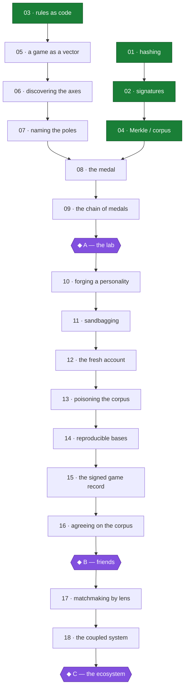
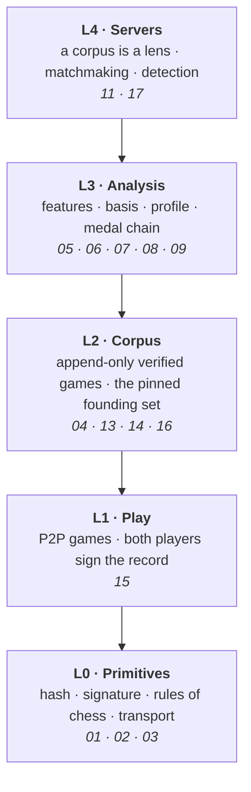

# MetaPlan

*The one document that says what BlockChess is, what order it happens in, what
was cut, and what is still undecided. Where any other file disagrees with this
one, that file is stale.*

> **Scope, stated honestly.** This was written from `main` and PR #1 alone. The
> repository actually holds **four distinct projects** on six branches, three of
> which this document never saw — the corpus/compression trunk on
> `claude/youthful-cori-l69v75` (six crates, twelve papers, 121k games) and the
> Chess Frontier Atlas on `claude/youthful-lamport-snidcm` (eight visual layers
> over a board, a whole engine in one HTML page). See `CLAUDE.md` for the map.
>
> So this is the plan for **one** of the four, not the reconciliation of all of
> them. That reconciliation has not been done and is the largest open item in
> the project. Everything below stands on its own terms; it just does not yet
> know what it is standing beside.

---

## The central idea

> **You are a function from positions to moves. This project compresses that
> function, makes the compression your public name, and chains it over time so
> the record of who you were becomes the record of who you became. It needs a
> chain because a lens is only fair if everyone can verify the corpus it was
> fitted to.**

The short form, for a reader in a hurry:

> **Your play is your name, and you don't get to hide it.**

Four clauses, each load-bearing:

- **"a function from positions to moves"** — a player *is* a policy. Not a
  rating, not a profile someone filled in. The thing to be compressed is
  well-defined before any code is written.
- **"the compression is your public name"** — identity is *derived*, not
  assigned or chosen. Anyone can recompute it from public games.
- **"chained over time"** — one hash is where you stand; the chain is how you
  got there. The chain is the medal.
- **"a lens is only fair if the corpus is verifiable"** — this is the answer to
  the question every chain project fails: *why does this need a blockchain?*

---

## What changed, and why the change was cheap

This project began as a chess **wagering** chain: every layer justified by
protecting money. It is now a chess **identity** chain: every layer justified by
computing, committing to, and defending a derived personality.

That reads like a rewrite. At the level of prose it partly is. At the level of
code it costs **nothing** — all four existing crates survive unchanged, and
each one's job in the new design is at least as load-bearing as its old one:

| Crate | Old job | New job | Status |
|---|---|---|---|
| `bc-hash` | hash game states | commit to a profile; chain the medals | **unchanged** |
| `bc-sig` | sign moves for money | authenticate — prove you are at the keyboard | **unchanged** |
| `bc-chess` | on-chain referee for disputes | validate that a submitted game is real chess | **unchanged** |
| `bc-merkle` | commit to account balances | commit to the **corpus** the lens is fitted to | **unchanged** |

The oracle standard is unchanged too, and it is still the project's central
claim to credibility:

> No layer is built on top of rules that have only been verified by tests we
> wrote ourselves.

FIPS 180-4, RFC 8032, published perft counts, RFC 6962 vectors. `bc-style` adds
one more: a symmetric eigensolver checked against matrices with analytically
known spectra.

---

## Settled

Decisions that outrank everything in `spec/`. Grouped by what they answer.

### The deliverable

- **S1 — The series is the deliverable; the running system proves it is real.**
  This is the tie-breaker `spec/09` was applying silently. It ratifies D2
  (Rust), D3 (no VM), D14 (a tagged runnable commit per episode, promoted from
  style to structural requirement) and D15 (defer SMT compression, keep the
  naive tree as its oracle).
- **S2 — Written episodes first.** Video only for the ones that earn it. Every
  artifact produced so far is prose and the specs are most of the text already.
- **S3 — Two artifacts per episode, and the learner one is derived.** The
  *manual* is ground truth: precise, versioned with the code, sufficient to
  reimplement from. The *narrative* is written second, **from** the manual —
  it selects a path, supplies the attack, carries the bridges from electrical
  engineering. Because it is derived it can never contradict the manual.
- **S4 — Two maps over one node set; learning map first.** Spec files are
  ordered by system layer, episodes by attack. Nothing is renumbered; the
  crosswalk below is the join. **The manual is ordered by build order, the
  narrative by dependency order, and they are allowed to differ.**
- **S5 — Two episode types.** *Attack episodes* have the shape: one cheat, the
  mathematics that kills it, working code. *Milestone episodes* carry the
  plumbing that no attack motivates — transport, discovery, the client — at the
  moment the system becomes real.

### The idea

- **N1 — Identity is derived, not assigned.** Your public name is computed from
  your play by anyone who has the corpus.
- **N2 — Derived identity is not a key.** A secret derived from public games
  would be public. So: an ordinary Ed25519 keypair proves *you are at the
  keyboard* (**authentication**, cryptographic); the derived profile proves
  *this play came from that personality* (**attribution**, statistical). The
  repo previously conflated these.
- **N3 — Identity is a hash chain of successive compressions.** One hash is a
  position in personality space; the chain is the narrative of arriving there.
  This is `spec/04`'s own argument one level up — *a chain of hashes turns a
  statement about one thing into a statement about everything that led to it.*
- **N4 — A link is earned by changing, not by playing.** A link is emitted when
  your position moves past a threshold. A long chain therefore means a player
  who genuinely grew, not one who merely showed up. This is what makes it a
  medal rather than a logbook.
- **N5 — The profile is a coordinate vector in a named basis; the hash commits
  to it.** Readable because the basis is named — *forty percent Tal, twenty-five
  percent Petrosian* — while still being a vector you can do linear algebra on.
- **N6 — Axes are discovered, then named.** Factorise a corpus, let the natural
  axes fall out, then name each one after whoever sits furthest along it.
  "Here are the empirical dimensions of chess personality" is a finding; a
  hand-picked list of favourite players is not.
- **N7 — Axes are bipolar spectra, not non-negative parts.** Each axis is a
  *tension* with a name at each pole (sharp ↔ prophylactic). Negative
  coefficients are meaningful: every concept exists on a spectrum with its
  opposite. This rules out NMF in favour of eigen-decomposition of the
  covariance.
- **N8 — Hand-picked features first, as the oracle for the learned model.** The
  same pattern the repo already runs twice (throwaway PoW before BFT; naive SMT
  before the compressed one). If the learned embedding and the readable
  features disagree about a player, one of them is broken.
- **N9 — The chain's job is to be the corpus.** A ledger of *evidence*, not
  balances. A basis is only meaningful if everyone derives the same one, which
  requires everyone reading the same games in the same order. A mutable database
  cannot provide that: an operator could quietly add or drop games, shift the
  axes, and silently re-judge every player who ever earned a medal.
- **N10 — A corpus is a lens, so identity is a pair.** Different servers fit
  different bases and legitimately judge the same player differently. Your hash
  is never absolute; it is your position *under a stated lens*. A complete
  identity is `(corpus root, position in it)`.
- **N11 — The three scales are one operation.** A **game** is a point, a
  **player** is a trajectory of points, a **corpus** is the basis those points
  are expressed in. Same compression at three altitudes.
- **N12 — A game is relational.** A player alone is `p(move | position)`; a game
  is `p(move | position, opponent)`. The gap is the interaction term. So the
  lens of a single game is a joint object neither player owns, and **your medal
  is not purely yours** — who you played shaped who you became, and a group's
  trajectories are one coupled system, not N independent ones.
- **N13 — Hybrid corpus.** An external corpus (Lichess-scale, pinned by hash)
  founds the first basis so the system is not born empty; the chain accretes
  from there. This is the cold-start answer: no lens without a corpus, no
  medals without a lens, no players without medals.

### The system

- **N14 — Friends-scale is the target, not a stepping stone.** Ten to a hundred
  known people, peer-to-peer or on a server one of them hosts. **No token, no
  mining reward, no slashing, no bonds, no economic security, no anonymous
  validators.** This is a deliberate narrowing and it deletes most of the hard
  part.
- **N15 — Analysis is the reward for running a node, not the consensus
  mechanism.** You run a node because that is how you get the models — you get
  to see how you and your friends actually play. Consensus itself is small and
  boring among known identities. *Proof-of-analysis as a consensus rule is a
  separate research project and is explicitly not this one.*
- **N16 — Servers survive, repurposed.** Each server is a corpus, therefore a
  lens, therefore its own matchmaking and its own cheat detection. `spec/07`
  keeps its structure and loses its custody tiers.
- **N17 — Finance is deferred, not deleted.** Wagering stays in the design as a
  later phase. Nothing in the identity layer may assume it, and nothing may
  make it impossible.

---

## Wheat and chaff

An honest pass over the existing repository.

### Wheat — survives unchanged

`bc-hash`, `bc-sig`, `bc-chess`, `bc-merkle`, and `docs/build-log.md` (still the
best-written thing in the repo, and its entries 02 and 03 are the argument for
why the oracle standard exists). `spec/01` (primitives), `spec/03` (position and
move encoding) survive whole.

### Wheat — survives, repurposed

| Item | Was justified by | Now justified by |
|---|---|---|
| `spec/02` the chain | settling stakes | committing the corpus (N9) |
| `spec/04` the channel | avoiding on-chain fees per move | producing a signed game record both players attest to |
| `spec/07` servers | matchmaking for a rake | a server is a lens (N10, N16) |
| Episode 13, cheat detection | protecting a pot | attribution failure — the same machine, run adversarially |
| Episode 14, Bayesian ratings | fair odds | strength is one axis of the profile, and its uncertainty term is a statement about how many games it took to compress you |

### Chaff — cut or deferred

| Item | Why it goes |
|---|---|
| Threat model A9, A10, A13 (validator censorship, reorg, Sybil-for-rewards) | Armour for anonymous adversaries with money at stake. Ten friends are neither (N14). |
| Server trust ladder T3/T4, bonds, slashing, proof-of-liabilities | Custody is a money problem (N14, N17). |
| `spec/06` §2–4, 7–8 — handicap odds, rake, Kelly, where the money is | Finance. Deferred with N17. |
| `spec/05` adjudication machinery — clock dilation, dispute budgets, forced inclusion | Beautiful, and it exists to protect money under a deadline. Deferred whole, with the *mate-claim refutation* idea kept in reserve because the ∀/∃ asymmetry is reusable. |
| Episode 05, proof-of-work | Its only justification was teaching. N14/N15 removed the fight it was armour for. Kept as **optional**, not spine. |
| Episodes 11, 12 — odds, Kelly | Finance. Deferred. |
| `spec/08` privacy ladder — stealth addresses, confidential stakes | **Direct contradiction with the thesis.** That ladder exists to make you unlinkable; this project's claim is that your play is your name. Transport encryption (L0) survives; the rest is cut. |
| Atlas claim: *"Milestone E is the project"* | False under S1. Every shipped episode is a deliverable. |
| Atlas Branch 2 "breadth" — ship a custodial server for early users | Closed. Custody teaches nothing and contradicts the thesis. |

**The privacy cut deserves a line of its own.** It is the largest single piece
of good work being dropped, and it is dropped on principle rather than for
scope: total visibility is the point, and the pros and cons of that are a thing
this project should argue in public rather than hedge.

---

## The curriculum

Rebuilt on the identity-attack spine. Same shape as before — an attack, the
primitive that kills it, working code, the mathematics underneath — pointed at
identity instead of money.

### Foundations — *what is the object*

| # | The attack | The primitive | Crate | State |
|---|---|---|---|---|
| 01 | "That's not the game I played" | hash functions, hash chains | `bc-hash` | **done** |
| 02 | "That wasn't my game" | Ed25519 signatures | `bc-sig` | **done** |
| 03 | "That game is legal, trust me" | rules as code, bitboards | `bc-chess` | **done** |
| 04 | "Here's a different corpus" | Merkle & sparse Merkle trees | `bc-merkle` | **done** |

### The compression — *the new core*

| # | The attack | The primitive | Crate |
|---|---|---|---|
| 05 | "You can't measure how I play" | a game as a feature vector | `bc-style::features` |
| 06 | "You decided what the dimensions are" | covariance, symmetric eigendecomposition, PCA | `bc-style::linalg` |
| 07 | "Your axes are meaningless numbers" | naming the poles — the chess gods | `bc-style::basis` |
| 08 | "That profile isn't mine" | the medal: profile → commitment | `bc-style::profile` |
| 09 | "I've always played like this" | the chain of medals; a link earned by change | `bc-style::chain` |

### The adversaries of identity

| # | The attack | The mathematics |
|---|---|---|
| 10 | "I'll play like you and steal your medal" | how many bits is a personality? distinguishability, the birthday bound — `bc-style::identify` |
| 11 | "I'm not sandbagging, I'm just off form" | likelihood ratios, KL divergence, Wald's SPRT |
| 12 | "I'll just start a fresh account" | convergence — how many games until you are re-identified — `bc-style::identify` |
| 13 | "I'll poison the corpus so the axes move my way" | basis stability, influence, reproducibility |
| 14 | "That isn't the basis you published" | deterministic factorisation over a pinned corpus |

### The system

| # | The attack / moment | What it is |
|---|---|---|
| 15 | "I'll play you, but you can't have my games" | the signed game record; P2P play (`spec/04`, repurposed) |
| 16 | "My node says the corpus is different" | small-group agreement among known identities |
| 17 | "Match me with someone I'll enjoy playing" | personality-aware matchmaking; servers as lenses |
| 18 | "A player alone is a fiction" | the interaction term; coupled trajectories (N12) — `bc-style::interaction`, measured with a permutation test and a placebo control |

**Deferred spine** (returns with N17): wagering channels, adjudication under
money, the privacy ladder, SNARK settlement.

---

## The learning map

Green is code-complete today. Note what the pivot did to the shape: the crypto
track (01→02→04) and the chess track (03→05) are still independent, and they now
merge at **08**, the medal — earlier than the old design's episode 07.

### The milestones

| | The moment | Plumbing it carries |
|---|---|---|
| **◆ A — the lab** | one player's games in, clusters and a trajectory out | PGN ingest, a CLI, plots |
| **◆ B — friends** | ten people play, the corpus grows, medals mint from it | transport, peer discovery, the client, small-group agreement |
| **◆ C — the ecosystem** | the coupled system is visible and matchmaking runs on it | a server, a web view |

**Milestone A needs no chain, no network, and no consensus.** It is the smallest
complete version of the whole idea, and it is what gets built first.

---

## The system map

The old stack had five layers of machinery between a player and their money.
This one has four between a player and their portrait, and the middle two are
where all the interesting mathematics now lives.

---

## Build order

1. **`bc-style`, the lab** — Milestone A. Ingest games, extract features,
   discover a basis, name it, commit a profile, chain the medals. Offline, no
   network, no chain. *In progress.*
2. **Validate against real humans** — run the lab over a pinned Lichess export
   and answer episode 10's question empirically: how many bits is a personality?
   Until that number is known, the medal's forgeability is unknown and every
   claim downstream is provisional.
3. **The signed game record** — two players, one game, both signatures, one
   canonical encoding. Small, and it is the seam between the lab and the system.
4. **Friends** — Milestone B.

**When unsure what to work on:** ask which task most directly shortens the path
to the next published episode. Four times so far the answer has been writing
rather than code.

---

## Still open

| # | Question | Blocks |
|---|---|---|
| **O1** | Where do written episodes live? Never discussed; now the primary product surface. | Shipping 01–04. **Urgent.** |
| **O2** | Which hand-picked features actually define a chess personality? A taste question, not a technical one. | The honesty of episode 05. |
| **O3** | How many bits is a chess personality? **Method now built; the number is not trustworthy yet.** `style identify` measures it — held-out attribution, a convergence curve, and the closest pair in quantisation cells. On four constructed players: 7 games to identify, closest pair 39 cells apart, upper bound 30.7 bits. All of that is about *synthetic* players and speaks for nothing human. Point it at a real corpus. | The medal's whole security argument. |
| **O4** | Does a link in the medal chain need a countersignature, or is a corpus commitment enough? | Episode 09's threat model. |
| **O5** | Licence contradiction — `README` says TBD, `Cargo.toml` already declares Apache-2.0, D13 recommends Apache-2.0 plus CC BY-SA 4.0 for prose. | Trivial; embarrassing to leave. |
| **O6** | Real time budget. The atlas assumed ~10–15 h/week and every date in it is fiction until confirmed. | Every schedule. |

### Prior art to check before building far

The Maia chess group (McIlroy-Young, Sen, Kleinberg, Anderson) built
human-move-prediction models and, I believe, follow-up work on identifying
*individual* players from their moves. Verify this early. Under this project's
own standard that is not a threat — it is the external oracle this layer would
otherwise lack.
