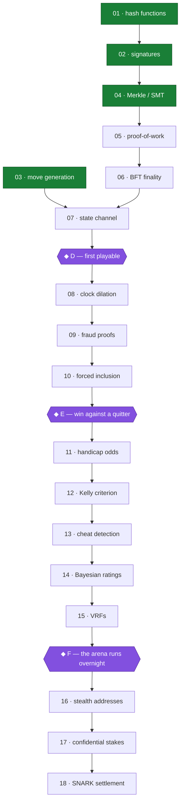
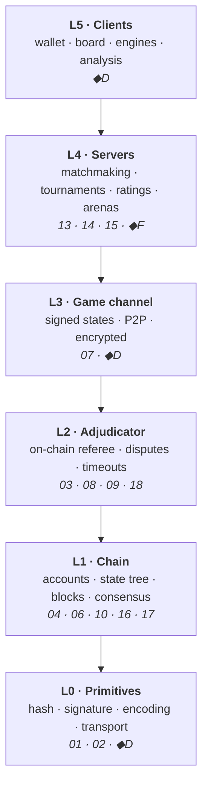

# MetaPlan

*The single document that says what BlockChess is, what order it happens in,
and what is still undecided. If this file disagrees with any other file in the
repository, this file is wrong and should be corrected — but read it first.*

---

## The central idea

> **A public course in applied cryptography, taught by building a chess
> wagering chain that actually works. Every primitive is introduced by the
> theft it prevents. The running system is the proof the course is not lying.**

Three sentences, and each one is load-bearing:

- **"A public course"** — the series is the deliverable. Not the chain.
- **"introduced by the theft it prevents"** — the attack list is the syllabus.
  Nothing is taught abstractly, and nothing is built that no attack motivates.
- **"the proof the course is not lying"** — the protocol exists so that every
  claim in the course is backed by code that runs, checked against an oracle
  someone else published.

Everything below follows from those three clauses.

---

## The five settled decisions that outrank the rest

These sit above `spec/09`, and where a decision there conflicts with one of
these, these win.

### S1 — The series is the deliverable; the protocol proves it is real

This is the tie-breaker that `spec/09` was applying silently. It ratifies the
decisions there that cost time for teaching reasons and makes them correct
rather than merely defensible:

| Decision | Why S1 ratifies it |
|---|---|
| D1 — own chain | "Months rather than weeks to first game" is a bad trade for a product and the right trade for a course, because every layer becomes yours to explain. |
| D3 — no VM | A world computer teaches nothing about chess settlement and costs a year. |
| D4 — throwaway PoW before BFT | Indefensible for a product. Correct here: you cannot feel why finality matters until you have watched your own chain reorg away a dispute. |
| D5 — play-token first | Real money adds legal exposure and zero pedagogical value. |
| D14 — a tagged runnable commit per episode | Promoted from style to **structural requirement**. The repository history *is* the syllabus. |
| D15 — defer SMT path compression | The naive tree is the oracle for the compressed one, which is itself a later episode. |

**Two claims elsewhere in the repo are now false and must be struck, not edited:**

1. `docs/atlas.md`: *"Milestone E is the project. Everything before it is
   prerequisites."* Under S1 there are no prerequisites — only unreleased
   episodes. Episode 01 is a complete deliverable the day it ships.
2. `docs/atlas.md` Branch 2, the "breadth" path (ship a T3 custodial server to
   get users early). A custodial server teaches nothing and contradicts the
   thesis. That branch is **closed**, not open.

### S2 — Written first; video only for episodes that earn it

Every artifact produced so far is prose, and the specs are already most of an
episode's text. Written episodes ship in days from what exists; video is a
separate production discipline with a much larger audience ceiling and roughly
an order of magnitude more cost per episode. Write first. Film the ones that
deserve it.

### S3 — Two artifacts per episode, and the learner one is derived

- **The manual** — precise, versioned with the code, sufficient for a competent
  engineer to reimplement from. This is the ground truth. `spec/` and
  `docs/build-log.md` are already this, and `build-log.md` is the best-written
  thing in the repository.
- **The narrative** — written *second, from the manual*. Selects a path through
  it, supplies the attack that motivates the primitive, and carries the
  bridges from electrical engineering.

The containment relation matters: because the narrative is derived, it can
never contradict the manual, and the expensive artifact is only written for
episodes that warrant it — the same rule as video.

### S4 — Two maps, one node set, learning map first

The learning map is the entry point; the system map is where you go once the
learning map is mastered. This resolves the numbering collision — spec files
`00–09` are ordered by **system layer**, episodes `01–18` by **attack** — with
no renumbering. They are two different maps over the same material, and the
crosswalk below is the join.

It also resolves the ordering conflict without picking a side:

> **The manual is ordered by build order. The narrative is ordered by
> dependency order. They are allowed to differ.**

Which is exactly why a metro map is the right object: its whole purpose is
showing that several valid routes exist across one fixed network.

### S5 — Two episode types: attack episodes and milestone episodes

The 18 attack episodes all share one shape — a cheat, the mathematics that
kills it, working code — and that shape is the series' entire value. But five
system components have no attack behind them and therefore no episode:

| Missing component | Status before this document |
|---|---|
| Noise transport | one paragraph in `spec/01`, never built |
| Peer discovery, NAT traversal | D9 gestures at libp2p and moves on |
| Wallet / client (L5) | the entire surface a human touches — unspecified |
| Server bonds and slashing | specified in `spec/07`, taught nowhere |
| Monetary policy / issuance | **D10 assumes it exists. It does not.** |

Which means: **the 18 episodes are a complete curriculum and an incomplete
system.** Someone could follow every episode as written and not have a thing
two people can play on.

The resolution is not to write five dull episodes — the dominant failure mode
of a solo series is fatigue, and NAT traversal has no beautiful idea in it.
Instead, **plumbing is built and specified but not taught on its own; it ships
inside a milestone episode**, motivated by the milestone rather than by an
attack. The atlas already contains these milestones (D, E, F); it simply never
noticed they were episodes.

---

## The learning map

Follow this first. Diamonds are milestone episodes; boxes are attack episodes.

Green nodes are code-complete today. The two tracks — crypto and chess — are
genuinely independent until episode 07, which is the single most useful fact on
this map: when one track frustrates you, switch. That is the real dependency
structure, not procrastination.

### What each milestone episode carries

| Milestone | The moment | Plumbing it ships |
|---|---|---|
| **D** — first playable | two people play a wagered game that settles, as long as neither cheats | Noise transport, peer discovery, NAT traversal, the wallet |
| **E** — win against a quitter | "as long as neither cheats" disappears — the first genuinely trustless wagering system | dispute client, watchtower (a cron job, per `spec/04`) |
| **F** — the arena runs overnight | bots wagering unattended, with ratings | server registry, bonds, slashing, matchmaking service |

Milestone E is still where the project becomes what it claims to be. It is no
longer "the project" — under S1 every shipped episode is already that — but it
remains the point at which the thesis is demonstrated rather than asserted.

---

## The system map

Go here after the learning map. Same components, arranged by what depends on
what at runtime rather than by what you learn first.

Traffic falls off a cliff going down. A 40-move blitz game is ~80 signed states
at L3 and **two transactions** at L1. That ratio is the whole reason the system
can be private and cheap at once.

Note what has no layer: **episode 05 (proof-of-work) is deliberately thrown
away**, and **episode 12 (Kelly) teaches the player, not the protocol**. Those
are the only two learning nodes with no system home, and both are intentional.

---

## Crosswalk

The join between the two maps. Read a row as: *this attack, taught here, lives
in this layer, specified in this file, built in this crate.*

| Ep | Attack | Layer | Spec | Crate | State |
|---|---|---|---|---|---|
| 01 | "I moved first, actually" | L0 | `01` | `bc-hash` | **done** |
| 02 | "That wasn't my move" | L0 | `01` | `bc-sig` | **done** |
| 03 | "That move was legal, trust me" | L2 | `03` | `bc-chess` | **done** |
| 04 | "Here's a different game history" | L1 | `02` | `bc-merkle` | **done** |
| 05 | "My version of history is the real one" | — | `02` | `bc-pow` | next |
| 06 | "I'll reorg away your dispute" | L1 | `02` | `bc-consensus` | |
| 07 | "80 transactions per game is absurd" | L3 | `04` | `bc-channel` | |
| ◆D | *first playable* | L5/L3/L0 | — | `bc-net`, `bc-wallet` | |
| 08 | "I'll just stop replying" | L2 | `05` | `bc-adjudicator` | |
| 09 | "That's checkmate (it isn't)" | L2 | `05` | `bc-adjudicator` | |
| 10 | "I'll censor your dispute" | L1 | `02` | `bc-consensus` | |
| ◆E | *win against a quitter* | L3/L2 | — | `bc-watchtower` | |
| 11 | "This bet is fair, honest" | L5 | `06` | `bc-odds` | |
| 12 | "You can get rich playing even games" | — | `06` | `bc-odds` | |
| 13 | "I'm not using an engine" | L4 | `06` | `bc-detect` | |
| 14 | "Your rating is 1200, honest" | L4 | `06` | `bc-rating` | |
| 15 | "I chose the tournament bracket" | L4 | `07` | `bc-vrf` | |
| ◆F | *the arena runs overnight* | L4 | `07` | `bc-server` | |
| 16 | "I can see every game you played" | L1 | `08` | `bc-stealth` | |
| 17 | "I can see how much you bet" | L1 | `08` | `bc-confidential` | |
| 18 | "Disputes reveal my whole game" | L2 | `08` | `bc-snark` | |

---

## The standard, unchanged

> No layer is built on top of rules that have only been verified by tests we
> wrote ourselves.

Every crate is checked against an oracle *someone else* published: FIPS 180-4
for the hashes, RFC 8032 for Ed25519, published perft counts for the move
generator, RFC 6962 vectors for the Merkle tree. `docs/build-log.md` entries 02
and 03 are the argument for why this rule exists — twelve hand-written tests
passed a bug that RFC 8032 caught immediately, and a reference implementation
written five minutes earlier was itself the thing that was wrong.

This standard is also the series' central claim to credibility. Keep it.

---

## The one urgent problem

**Four episodes are code-complete, oracle-verified, and green. Zero episodes
have shipped.** Under S1 that is not a minor gap in the plan — it is the plan
failing at its only job. Everything in this repository so far is input to a
deliverable that has never been produced.

Nothing below matters as much as fixing that.

---

## Still open

Decisions that genuinely are not made. Each needs an owner and a date.

| # | Question | Why it is open | Cost of leaving it |
|---|---|---|---|
| **O1** | Where do written episodes live? | Never discussed anywhere in the repo. Now the primary product surface. | Blocks shipping 01–04. **Urgent.** |
| **O2** | Ship 01–04 now, or build ahead to a bigger milestone first? | Atlas Branch 1 raises it for the engine only, never resolves it. | Compounding — the backlog grows. |
| **O3** | Monetary policy / issuance | D10 assumes validators "already earn issuance." No issuance design exists. | Blocks episode 06 honestly. |
| **O4** | Validator recruitment | An own-chain BFT design needs validators. No plan names who they are. | Blocks a real testnet, not the episodes. |
| **O5** | Upgrade authority (D11) | Explicitly political, explicitly deferred. Validator vote? Foundation key? | Low until a second adjudicator version exists. |
| **O6** | Licence contradiction | `README` says TBD; `Cargo.toml` already declares `Apache-2.0`; D13 recommends Apache-2.0 + CC BY-SA 4.0 for prose. | Trivial to fix; embarrassing to leave. |
| **O7** | Real time budget | Atlas assumes ~10–15 h/week around a third-year EE load. Unverified. | Every date in the atlas is fiction until confirmed. |

---

## What to do when unsure

The atlas's version of this rule was *"ask which task most directly shortens the
path to 'I can win against an opponent who disconnects'."* Under S1 that is no
longer right, because it optimises for the system rather than the deliverable.

The replacement:

> **Ask which task most directly shortens the path to the next published
> episode.**

Usually that is writing, not code. Four times so far, it has been writing.
